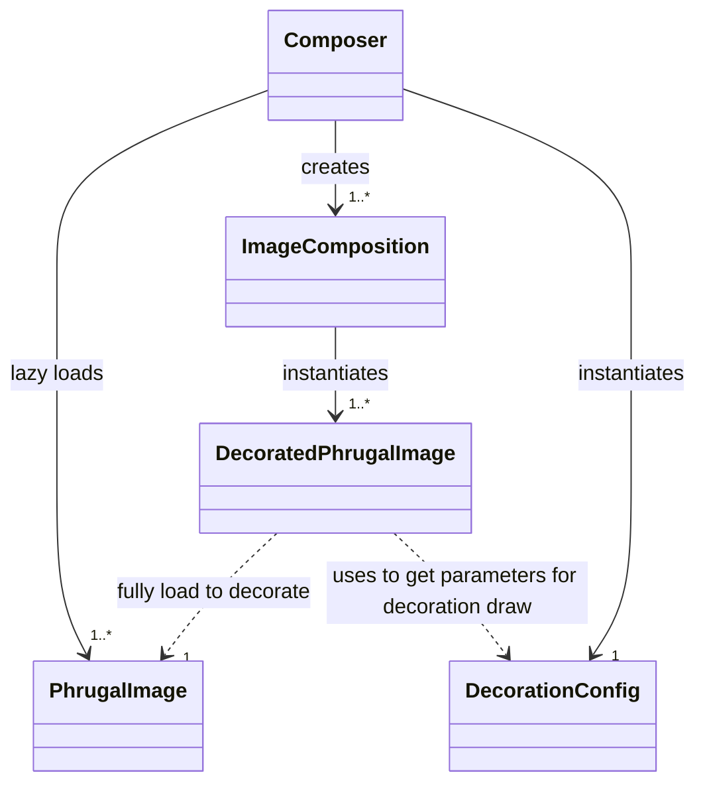

# architecture draft

```mermaid
classDiagram
    class PhrugalImage {
    }

    class DecoratedPhrugalImage {
    }

    class Composer {
    }

    class ImageComposition {
    }

    class DecorationConfig {
    }

    Composer --> "1..*" ImageComposition: creates
    Composer --> "1..*" PhrugalImage: lazy loads
    ImageComposition --> "1..*" DecoratedPhrugalImage: instantiates
    DecoratedPhrugalImage ..> "1" PhrugalImage: fully load to decorate
    DecoratedPhrugalImage ..>  DecorationConfig : uses to get parameters for decoration draw
    Composer --> "1" DecorationConfig : instantiates
```