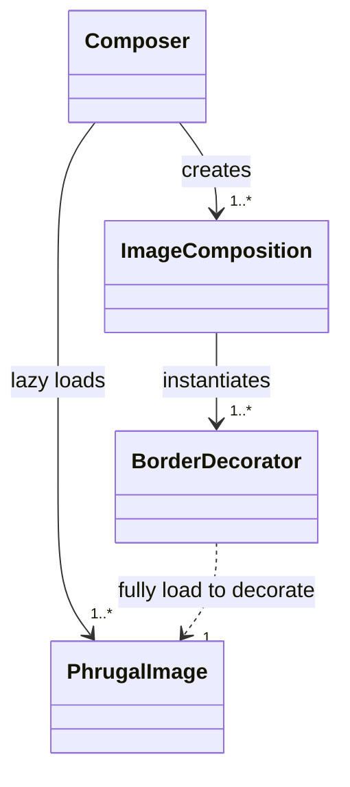

# architecture draft

```mermaid
classDiagram
    class PhrugalImage {
    }

    class BorderDecorator {
    }

    class Composer {
    }

    class ImageComposition {
    }

    Composer --> "1..*" ImageComposition: creates
    Composer --> "1..*" PhrugalImage: lazy loads
    ImageComposition --> "1..*" BorderDecorator: instantiates
    BorderDecorator ..> "1" PhrugalImage: fully load to decorate
```